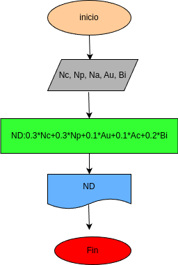

# Nota definitiva 
programa en python para calcular la nota definitva del coleio guanenta

# Instrucciones 
- Al ingresar las notas de la asignatura, utilice valores entre 10 y 50 
- No use puntos decimales ("."), ya que el programa solo acepta numeros enteros
 # Diagrama de flujo 

